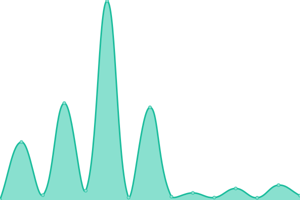

# [📈 Live Status](https://online.darunnajah.ac.id): <!--live status--> **🟧 Partial outage**

This repository contains the open-source uptime monitor and status page for [Universitas Darunnajah](https://www.darunnajah.ac.id), powered by [Upptime](https://github.com/upptime/upptime).

With [Upptime](https://upptime.js.org), you can get your own unlimited and free uptime monitor and status page, powered entirely by a GitHub repository. We use [Issues](https://github.com/upptime/upptime/issues) as incident reports, [Actions](https://github.com/fwzakiy/online/actions) as uptime monitors, and [Pages](https://online.darunnajah.ac.id) for the status page.

<!--start: status pages-->
<!-- This summary is generated by Upptime (https://github.com/upptime/upptime) -->
<!-- Do not edit this manually, your changes will be overwritten -->
<!-- prettier-ignore -->
| URL | Status | History | Response Time | Uptime |
| --- | ------ | ------- | ------------- | ------ |
|  [Situs Web Resmi Universitas Darunnajah](https://www.darunnajah.ac.id) | Aktif | [situs-web-resmi-universitas-darunnajah.yml](https://github.com/fwzakiy/online.darunnajah.ac.id/commits/HEAD/history/situs-web-resmi-universitas-darunnajah.yml) | 

 3906milidetik
     
 | 

<a href="https://online.darunnajah.ac.id/history/situs-web-resmi-universitas-darunnajah">100.00%</a>
    

|  [Sistem Informasi Akademik](https://simak.darunnajah.ac.id) | Aktif | [sistem-informasi-akademik.yml](https://github.com/fwzakiy/online.darunnajah.ac.id/commits/HEAD/history/sistem-informasi-akademik.yml) | 

 2272milidetik
     
 | 

<a href="https://online.darunnajah.ac.id/history/sistem-informasi-akademik">100.00%</a>
    

|  [Learning Manajemen System](https://lms.darunnajah.ac.id) | Aktif | [learning-manajemen-system.yml](https://github.com/fwzakiy/online.darunnajah.ac.id/commits/HEAD/history/learning-manajemen-system.yml) | 

 1134milidetik
     
 | 

<a href="https://online.darunnajah.ac.id/history/learning-manajemen-system">100.00%</a>
    

|  [ParentDesk](https://parentdesk.darunnajah.ac.id) | Aktif | [parent-desk.yml](https://github.com/fwzakiy/online.darunnajah.ac.id/commits/HEAD/history/parent-desk.yml) | 

 725milidetik
     
 | 

<a href="https://online.darunnajah.ac.id/history/parent-desk">100.00%</a>
    

|  [StudentDesk](https://studentdesk.darunnajah.ac.id) | Aktif | [student-desk.yml](https://github.com/fwzakiy/online.darunnajah.ac.id/commits/HEAD/history/student-desk.yml) | 

 688milidetik
     
 | 

<a href="https://online.darunnajah.ac.id/history/student-desk">100.00%</a>
    

|  [Student Cash](https://tukeuangan.darunnajah.ac.id) | Aktif | [student-cash.yml](https://github.com/fwzakiy/online.darunnajah.ac.id/commits/HEAD/history/student-cash.yml) | 

 1209milidetik
     
 | 

<a href="https://online.darunnajah.ac.id/history/student-cash">100.00%</a>
    

|  [Tracer Study](https://tracerstudy.darunnajah.ac.id) | Aktif | [tracer-study.yml](https://github.com/fwzakiy/online.darunnajah.ac.id/commits/HEAD/history/tracer-study.yml) | 

 473milidetik
     
 | 

<a href="https://online.darunnajah.ac.id/history/tracer-study">100.00%</a>
    

|  [Penerimaan Mahasiswa Baru](https://pendaftaran.darunnajah.ac.id) | Aktif | [penerimaan-mahasiswa-baru.yml](https://github.com/fwzakiy/online.darunnajah.ac.id/commits/HEAD/history/penerimaan-mahasiswa-baru.yml) | 

 439milidetik
     
 | 

<a href="https://online.darunnajah.ac.id/history/penerimaan-mahasiswa-baru">100.00%</a>
    

|  [SIAKAD STAI](https://siakad.darunnajah.ac.id) | Aktif | [siakad-stai.yml](https://github.com/fwzakiy/online.darunnajah.ac.id/commits/HEAD/history/siakad-stai.yml) | 

 1124milidetik
     
 | 

<a href="https://online.darunnajah.ac.id/history/siakad-stai">100.00%</a>
    

|  [e-Journal](https://ejournal.darunnajah.ac.id) | Aktif | [e-journal.yml](https://github.com/fwzakiy/online.darunnajah.ac.id/commits/HEAD/history/e-journal.yml) | 

 1077milidetik
     
 | 

<a href="https://online.darunnajah.ac.id/history/e-journal">100.00%</a>
    

|  [Repository](https://repository.darunnajah.ac.id) | Non-aktif | [repository.yml](https://github.com/fwzakiy/online.darunnajah.ac.id/commits/HEAD/history/repository.yml) | 

 1956milidetik
     
 | 

<a href="https://online.darunnajah.ac.id/history/repository">97.76%</a>
    

|  [e-Library](https://e-library.darunnajah.ac.id) | Aktif | [e-library.yml](https://github.com/fwzakiy/online.darunnajah.ac.id/commits/HEAD/history/e-library.yml) | 

 439milidetik
     
 | 

<a href="https://online.darunnajah.ac.id/history/e-library">100.00%</a>
    

|  [Sistem Informasi Bimbingan TA](https://bimbingan.darunnajah.ac.id) | Aktif | [sistem-informasi-bimbingan-ta.yml](https://github.com/fwzakiy/online.darunnajah.ac.id/commits/HEAD/history/sistem-informasi-bimbingan-ta.yml) | 

 751milidetik
     
 | 

<a href="https://online.darunnajah.ac.id/history/sistem-informasi-bimbingan-ta">100.00%</a>
    

|  [Sistem Informasi Kuliah Kerja Nyata](https://kkn.darunnajah.ac.id) | Aktif | [sistem-informasi-kuliah-kerja-nyata.yml](https://github.com/fwzakiy/online.darunnajah.ac.id/commits/HEAD/history/sistem-informasi-kuliah-kerja-nyata.yml) | 

 478milidetik
     
 | 

<a href="https://online.darunnajah.ac.id/history/sistem-informasi-kuliah-kerja-nyata">100.00%</a>
    

|  [Sistem Informasi LP3M](https://lp3m.darunnajah.ac.id) | Aktif | [sistem-informasi-lp-3-m.yml](https://github.com/fwzakiy/online.darunnajah.ac.id/commits/HEAD/history/sistem-informasi-lp-3-m.yml) | 

 995milidetik
     
 | 

<a href="https://online.darunnajah.ac.id/history/sistem-informasi-lp-3-m">100.00%</a>
    

|  [Sistem Informasi LP3M](https://monev.darunnajah.ac.id) | Aktif | [sistem-informasi-lp-3-m.yml](https://github.com/fwzakiy/online.darunnajah.ac.id/commits/HEAD/history/sistem-informasi-lp-3-m.yml) | 

 995milidetik
     
 | 

<a href="https://online.darunnajah.ac.id/history/sistem-informasi-lp-3-m">100.00%</a>
    

|  [Sistem Penjaminan Mutu](https://spmi.darunnajah.ac.id) | Aktif | [sistem-penjaminan-mutu.yml](https://github.com/fwzakiy/online.darunnajah.ac.id/commits/HEAD/history/sistem-penjaminan-mutu.yml) | 

 503milidetik
     
 | 

<a href="https://online.darunnajah.ac.id/history/sistem-penjaminan-mutu">100.00%</a>
    

|  [Pangkalan Data Pendidikan Tinggi](https://neo-feederuniv.darunnajah.ac.id) | Aktif | [pangkalan-data-pendidikan-tinggi.yml](https://github.com/fwzakiy/online.darunnajah.ac.id/commits/HEAD/history/pangkalan-data-pendidikan-tinggi.yml) | 

 110milidetik
     
 | 

<a href="https://online.darunnajah.ac.id/history/pangkalan-data-pendidikan-tinggi">100.00%</a>
    

|  [Pangkalan Data Pendidikan Tinggi](https://neo-feederuniv.darunnajah.ac.id) | Aktif | [pangkalan-data-pendidikan-tinggi.yml](https://github.com/fwzakiy/online.darunnajah.ac.id/commits/HEAD/history/pangkalan-data-pendidikan-tinggi.yml) | 

 110milidetik
     
 | 

<a href="https://online.darunnajah.ac.id/history/pangkalan-data-pendidikan-tinggi">100.00%</a>
    

|  [Generator Data](https://generator.darunnajah.ac.id) | Aktif | [generator-data.yml](https://github.com/fwzakiy/online.darunnajah.ac.id/commits/HEAD/history/generator-data.yml) | 

 326milidetik
     
 | 

<a href="https://online.darunnajah.ac.id/history/generator-data">100.00%</a>
    

|  [Importer STAI](https://importerstai.darunnajah.ac.id) | Aktif | [importer-stai.yml](https://github.com/fwzakiy/online.darunnajah.ac.id/commits/HEAD/history/importer-stai.yml) | 

 1651milidetik
     
 | 

<a href="https://online.darunnajah.ac.id/history/importer-stai">97.37%</a>
    

|  [Importer Universitas](https://importeruniv.darunnajah.ac.id) | Non-aktif | [importer-universitas.yml](https://github.com/fwzakiy/online.darunnajah.ac.id/commits/HEAD/history/importer-universitas.yml) | 

 0milidetik
     
 | 

<a href="https://online.darunnajah.ac.id/history/importer-universitas">100.00%</a>
    

|  [Kicau Darunnajah](https://kicau.darunnajah.ac.id) | Aktif | [kicau-darunnajah.yml](https://github.com/fwzakiy/online.darunnajah.ac.id/commits/HEAD/history/kicau-darunnajah.yml) | 

 980milidetik
     
 | 

<a href="https://online.darunnajah.ac.id/history/kicau-darunnajah">100.00%</a>
    

<!--end: status pages-->

[**Visit our status website →**](https://online.darunnajah.ac.id)

## 📄 License

- Powered by: [Upptime](https://github.com/upptime/upptime)
- Code: [MIT](./LICENSE) © [Anand Chowdhary](https://anandchowdhary.com), supported by [Pabio](https://pabio.com)
- Data in the `./history` directory: [Open Database License](https://opendatacommons.org/licenses/odbl/1-0/)
